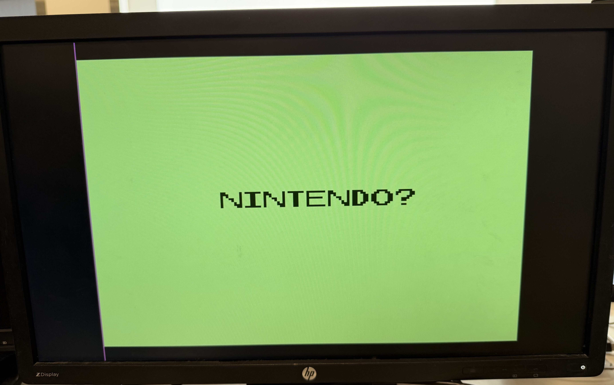

# fpga_sokoban
Implementation of classic puzzle game Sokoban to run on a Spartan-7 FPGA board. Includes SystemVerilog modules for graphics controller and audio processing unit. The game is programmed in C to be run by a MicroBlaze soft processor on the FPGA.

## Steps to Build/Run Project
1. Create a Vivado project, adding the constraints sokoban_project/constraints/gb_top.xdc.
2. Add all design sources under the sokoban_project/APU and the sokoban_project/top_folder/top_level.sv.
3. Import the block design located in top_folder directory.
4. Add RealDigital HDMI encoder IP (ip_repo/RD_hdmi_ip2020.zip) and our Graphics Controller IP (ip_repo/gb_gpu_1_0.zip) by extracting and adding to Vivado's IP catalog.
5. Run the bitstream for the project.
6. Export hardware and launch Vitis IDE using the exported platform.
7. Import the software sources lw_usb, game.c, and tileData.h from sokoban_project/software.
8. Connect power, HDMI, audio jack, and USB keyboard to the Spartan 7 Urbana Board.
9. Build the project and run it on the FPGA board. Have fun playing!

Note if you set up correctly upon boot-up, you should see this:

## Authors
- Raiyan Hasan & Alex Daniel
